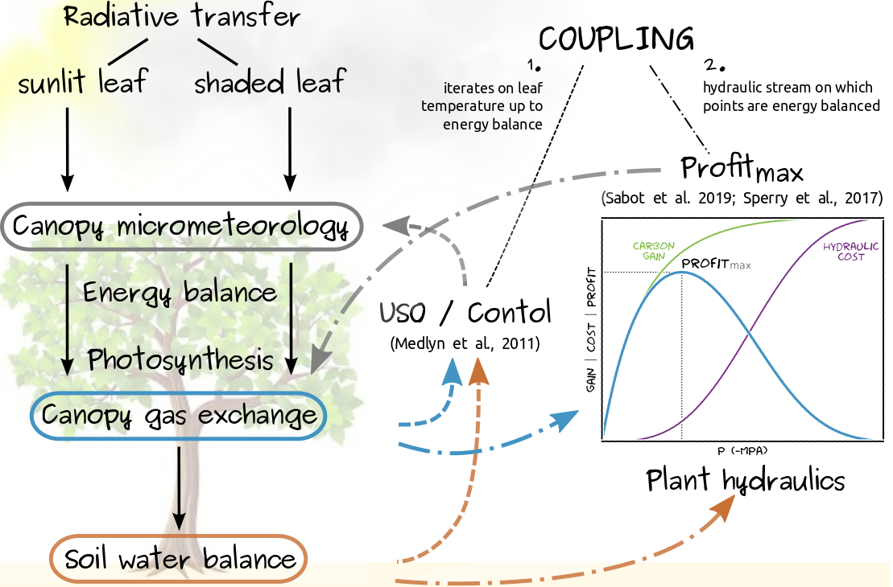
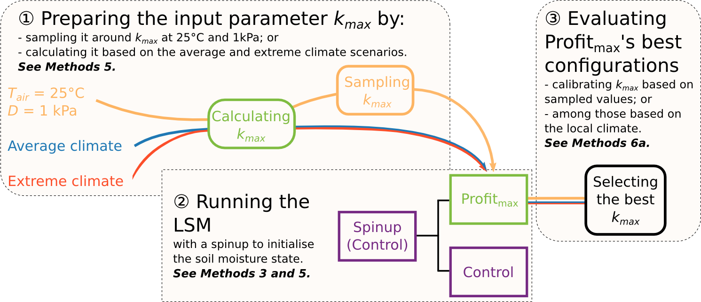

# The Profit Maximisation of European Forests

Manon E. B. Sabot, Martin G. De Kauwe, Andy J. Pitman, Belinda E. Medlyn, Anne
Verhoef, Anna M. Ukkola, and Gab Abramowitz

## Overview

Repository containing all the code to reproduce the results in
Sabot et al. (2019): Plant profit maximisation improves predictions of European 
forest responses to drought. New Phytologist, Accepted.

## General instructions

To make sure the model is properly set up, simply type:
```
make -f setup.mk
```
> N.B.: You need anaconda to use the existing environment files within which to
> run the model. By default, python3.7 will be used to run the model.
> If you would rather install the dependancies locally, you will need python.

Followed by:
```
source activate TractLSM37
```
> N.B.: If you prefer, you can activate TractLSM27 (the python2.7 version) or
> TractLSM (no specific associated module versions) instead.

&nbsp;&nbsp;

To regenerate all our results and figures, type:
```
make -f results.mk
```
> N.B. 1: By default, this uses 4 CPUs. However, if you have access to more
> CPUs and want things to speed up, change the NCPUs line 35 of 
> `src/predicting_kmax.sh` and line 31 of `src/var_solver_accuracy.sh`.

> N.B. 2: If the model runs are present in `output/projects/`, this will only
> relaunch the analysis and figures. To run all of the model experiments from
> scratch, you will first need to remove all of the specific experiment files
> from `output/projects/`. If you also want to recreate the input files from
> scratch, you can remove them from `input/projects/`, provided you have the
> eddy-covariance site data netcdf files stored in `input/fluxsites/met/` and in 
> `input/fluxsites/flux/`.

If you want to regenerate all the parameter calibrations for the Control model,
type:

```
make -f calib.mk
```
> N.B.: This is very long and would need to be performed on more than 4 CPUs.
> The CPU count can be increased at lines 30 in `src/calib_Zroot.sh`,
> `src/calib_g1.sh`, and `src/calib_fw.sh`

If you wish to clean up old log files from the `src/tmp/` folder, type:
```
make clean -f results.mk
```

&nbsp;

## The model

The **TractLSM** is a site-level simplified tractable Land Surface Model. It is
well suited to comparing assumptions with regard to modelling plant induced
carbon and water fluxes, as it represents soil hydrology using a simple water
balance “tipping bucket” model.

The schematics below show how the model works at a glance, but consult the
ReadMe in `src/TractLSM/` for more detail.



&nbsp;

## Datasets

### Eddy-covariance data

These data are to be stored in `input/fluxsites/met/` and in
`input/fluxsites/flux/`.

* dataset 1: [LaThuile Synthesis](https://fluxnet.fluxdata.org/data/la-thuile-dataset/)
* dataset 2: [FLUXNET2015](https://fluxnet.fluxdata.org/data/fluxnet2015-dataset/)

### LAI data

The forcing climatologies are provided in `input/fluxsites/LAI/`, but you might
wish to rebuild them (see `src/TractLSM/Utils/modis_lai_lat_lon.py` and
`src/TractLSM/Utils/met_flux_LAI_site_level.py`) using the latest MODIS data.

* dataset: [8-day MODIS MOD15A2Hv6](https://modis.ornl.gov/data.html)

### Background climate data

The calculations ensuing from these data are stored in
`input/fluxsites/info_sites.csv`, but should you wish to recreate them
(see `src/TractLSM/Utils/cru_climate_lat_lon.py`) you will need the tmp, tmn,
tmx, vap, pet, pre, and cld CRU TS v4.03 datasets.

* dataset: [CRU TS v4.03](https://crudata.uea.ac.uk/cru/data/hrg/cru_ts_4.03/)

### Plant trait data

The data are all stored in `input/fluxsites/info_sites.csv`.

#### V<sub>cmax,25</sub>

* source1: [Valentini (2003)](https://link.springer.com/book/10.1007/978-3-662-05171-9)
* source2: [Kattge et al. (2009)](https://doi.org/10.1111/j.1365-2486.2008.01744.x)
* source3: [Martin-StPaul (2012)](https://www.researchgate.net/publication/273256964_Functional_adjustments_of_holm_oak_Quercus_ilex_L_facing_increasing_drought_at_different_temporal_scales_Impacts_for_process_based_modeling)

#### g<sub>1</sub>

* source1: [De Kauwe et al. (2015)](https://doi.org/10.5194/gmd-8-431-2015)
* source2: [Lin et al. (2015)](https://doi.org/10.1038/nclimate2550)

#### P<sub>50</sub> and P<sub>88</sub>

* source1: [Martin-StPaul et al. (2017)](https://doi.org/10.5281/zenodo.854700)
* source2: [Choat et al. (2012)](https://doi.org/10.1038/nature11688)
* source3: [Lucani et al. (2019)](https://doi.org/10.1071/FP18077)

&nbsp;

## Experiments

### Varying k<sub>max</sub>

We conducted three experiments to vary (and predict) k<sub>max</sub>. If you
wish to reproduce these experiments with some flexibility, you can use the
following commands:

```
src/predicting_kmax.sh
```

varies k<sub>max</sub> depending on the site average, and then extreme climate
scenario;

```
src/predicting_kmax.sh -S
```

runs the calibration experiment;

```
src/predicting_kmax.sh -A
```

runs all three experiments.

The schematics below show how the experiments work at a glance, but consult
`src/predicting_kmax.sh` to understand the detail of the code.



&nbsp;

### Varying the instantaneous solving

The **TractLSM** allows to vary:
* the frequency of optimisation in the **Profit<sub>max</sub>**
* the solving windown around the previous leaf water potential in the
**Profit<sub>max</sub>**
* the resolution of the incremental changes between two water potentials on the
hydraulic stream

To explore the relative impacts of making any of these assumptions, simply type:

```
src/var_accuracy.sh
```

&nbsp;

### Calibrating the Control

The calibrated effective rooting depth used to run all of our experiments was
retrieved by running:

```
src/calib_Zroot.sh
```

For further calibration of the Control model, simply type:

```
src/calib_g1.sh
```

which calibrates the g<sub>1</sub> parameter; Or:

```
src/calib_fw.sh
```

which calibrates the soil moisture stress function.

&nbsp;

## CABLE outputs

**CABLE** outputs were generated using the [CABLE LSM](https://trac.nci.org.au/trac/cable)
version 2.0 revision 5320, and `output/CABLE_output/run_cable_site.py` and
`output/CABLE_output/cable_utils.py`.

The outputs are not stored in this repository but will be provided upon
request.

&nbsp;

## To go further...

If you wish to further explore model behaviour, simply make changes to
`src/irun.txt` (similar to a namelist) and type:

```
src/ExecTractLSM src/irun.txt
```

&nbsp;

## License

This project is licensed under the MIT License - see the [LICENSE](LICENSE) file for details

&nbsp;

## Contact

Manon Sabot: [m.e.b.sabot@gmail.com](mailto:m.e.b.sabot@gmail.com?subject=[ProfitMax_Europe_Code]%20Source%20Han%20Sans)

